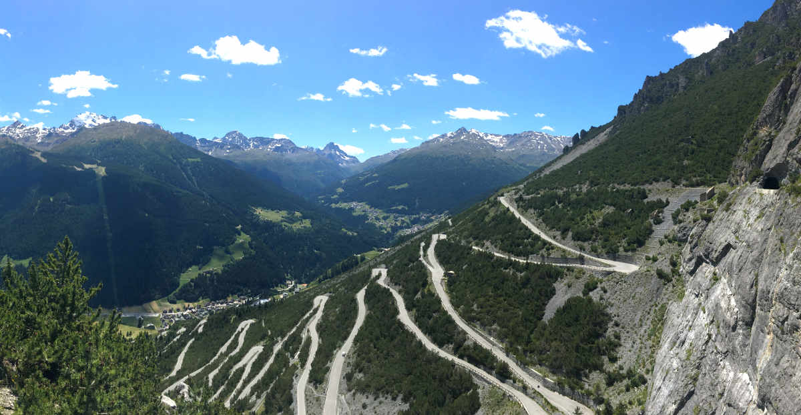

Compressed image formats get processed to make them better suited for the web.

File types that can't be compressed don't get processed e.g svg and gif.

## Plugins for Gatsby Images in Markdown Files

1. Gatsby
2. GraphQL
3. React