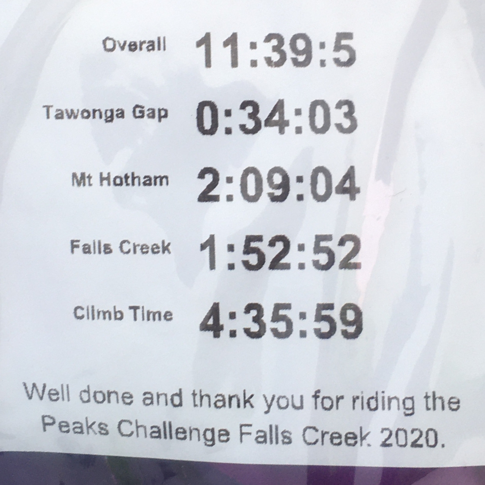

## Pre Event
My initial goal for [Peaks Challenge 2020](https://connect.garmin.com/modern/activity/4632008380) was to finish under 10 hours. A week before the event, my numbers helped me realise the goal was [too ambitious](https://drive.google.com/file/d/1Jy1mDE1Xa0SY-THpFjLS7nwjOHcWnLDR). At 88kg (275W 3.12W/kg) I was heavy, lowering my power compared to 2019 when I was just 84kg (FTP 285 3.39W/kg). I had gained weight during recovery from a crash; 3 weeks without riding, and over eating. Then another 2 week break from training during Christmas. Overall my training load was OK, but I wasn't in peak form compared to [2019](https://connect.garmin.com/modern/activity/3511071409) when I DNF due to sickness.

I decided to enjoy the ride and finish.

### Official Timing

|               |Time of Day|Chip       |Time Sector|Speed    |
|---------------|-----------|-----------|-----------|---------|
|Start          |6:56:00    |.          |.          |.        |
|TawongaBase    |7:50:35    |0:54:34    |0:54:34    |36.9 km/h|
|TawongaTop     |8:24:37    |1:28:37    |0:34:02    |12.9 km/h|
|HothamBase     |9:29:18    |2:33:17    |1:04:40    |30.7 km/h|
|HothamTop      |11:38:21   |4:42:21    |2:09:03    |13.1 km/h|
|Omeo           |14:10:46   |7:14:45    |2:32:24    |21.8 km/h|
|FallsCreekBase |16:12:25   |9:16:24    |2:01:38    |19.8 km/h|
|FallsCreekTop  |18:05:17   |11:09:16   |1:52:52    |12.8 km/h|
|Finish.        |18:35:54   |11:39:53   |0:30:37    |26.1 km/h|

My [official event timing](https://www.bicyclenetwork.com.au/rides-and-events/peaks-challenge/event-timing/)

## Tips
- You don't need a long stop at Dinner Plain; recover while descending into Omeo.
- Prepare for cold and wet and changing weather conditions.
- At the stops just refill and go - otherwise you waste a lot of time.

## Nutrition

### Pre Event
I supplemented with creatine, citrulline malate, beta alanine supplements during training. It's not clear what effect they had on my performance. I drank a lot of beetroot juice the week before the ride which seemed to lower my heart-rate during the event ride. I drank Endura Electrolyte which has magnesium regularly the week coming into the ride, which might be why I didn't cramp, a problem I have suffered previously. My legs felt consistently strong throughout the ride.

### During Event
The drink mix I prepared tasted terrible, and had too much caffeine. On the climbs I consumed an Endura Cola gel and some Cliff Bar Blocks; the Blocks where more convenient to eat then gels. From Dinner Plain I switched to drinking SIS Electrolytes(1 scoop Blackcurrant or Lime) provided by the event. It worked well, tasted good and kept me fuelled; keeping my energy level stable.

I drank a lot and stopped regularly to pee.

The lunch stop at Dinner Plain provided chicken and hummus wrap, which tasted bland but did the job. At Omeo I had vegan brownies that tasted good, boosted my energy and were easy to digest.

I appreciated the Vegemite scroll at Anglers Rest. It was nice to eat solid food.

## Equipment

- Bike: Giant TCR 2015 rim brakes
- Gearing: Compact crack set with 11-28 cassette
- Wheels: Fulcrum 3
- Tyres: GP4000
- Groupset: Shimano 105
- Computer: Garmin 830
- Heart Rate: Polar H10
- Drink Bottles: 650ml Camelbak, 750ml Elite

Happy with equipment, everything functioned well.

## Clothing

- Jersey: Van Rysel Road Sport Cycling Summer Jersey from Decathlon 
- Bibs  : Rapha Pro Thermal Bibs
- Gillet: Café Du Cycliste Jacqueline
- Base Layer: Sleeveless from Wiggle
- Gloves: Short finger from Decathlon
- Arm Warmers: Running Arm Covers from Decathlon
- Socks : Decathlon
- Shoes : Bontrager Velocis
- Neck Warmer: Kathmandu
- Scull Cap: Vermarc Thermal
- Cap  : Van Rysel from Dacathalon

#### Dropped after descent

- Long Sleeve jacket: NZO Tarmac
- Leg Warmers: Sugoi Thermal
- Toe Covers : Vermarc

Definitely should have kept the toe covers.

## Training
My training wasn't ideal, lacking structure. I tried to follow the recommendations from my Garmin 830. What helped my endurance and finish was all the long low intensity rides that helped build my base.

### Event Training Rides
I did two training rides with Bicycle Network. Lake Mountain and the Kinglake Repeats. They were helped me to realise my 10 hour goal was too ambitious.

## Final Preparations - Last Week

### Condition
Didn't feel 100% the week before the ride, I felt a little sick and run down. The quantity of KMs the last 3 weeks of training was too low, and too intense.

## The Event 
The ride started at 6:55am. 
I completed the event in 11:39:05.

My time was effected by the cold weather on Hotham. If I had known the weather conditions at Omeo and how quick the conditions improved once I descended bellow the clouds, I would have had a short stop at Dinner Plain.

## Falls Creek Descent
Good conditions for the start, it was cold, but I was well dressed. The descent into Mt Beauty was good and went without any dramas, but I didn't like how fast and close some riders passed me. In Mt Beauty I stopped to give Nadia and Zara my Leggings, Jacket and toe warmers. I should have kept my toe warmers.

## Towonga Gap
Road strong up Towonga, and the road was dry for the descent and I caught up with Carlos at the bottom of the descent. Both of us got on the back of a group.

## Harrietville
The ride to Harrietville was fast and arrived we with the 10 hour group. Our group worked harder then I liked; to catch two groups in front of us. Carlos was lucky not to crash when a rider in front of him fell. The fallen rider was OK and got up. Harrietville I stopped to fill up the bottles and take a leak. 

5 minutes stopped at Harrietville.

## Mt Hotham
The last 10km up Mt Hotham in the cold wet conditions was very hard. But the most difficult part of the ride was from the 5km sign to Dinner Plain. Cold, wet, windy and because it was an easy downhill run the cold really started to sap the heat from my body. That 5km seemed the longest and most difficult for the ride.

## Dinner Plain
At Dinner Plain I caught up with my friends Carlos, Matteo. We were all cold, Matteo was suffering in the cold, Carlos seemed in good condition, I was somewhere in between and scared conditions could stay the same or get worse. Their didn't seem to be information about the conditions ahead of us. My legs at this stage were sore, but my energy was OK. Stopped at 

40 minutes stopped at Dinner Plain.

## Omeo
Luckily Carlos was positive he would continue, and we all follow. I put a large plastic bag under my top which really helped keep the cold out. Once we descended under the clouds, the road was dry and the temperature started to rise and my clothes dried. Mt Hotham to Omeo was an easy ride with lots of fast easy descents; very enjoyable. In Omeo I caught up with Matteo and refuelled; eating some vegan brownies, and drinking SIS Electrolytes.

15 minutes stopped at Omeo.

## Anglers Rest
The ride from Omeo to Anglers Rest was another easy section, flat, rolling hill and good weather. Carlos and I rode together. We had a short stop at Anglers rest, ate a Vegimite Scroll and refilled my water bottles. Then walked across the wooden bridge for a quick pee in the bushes and waited for the 12 hour group. I started with the group, but gradually went ahead with some other riders.

10 minutes stopped at Anglers Rest.

## WTF Corner and back of Falls Creek
I reached WTF Corner feeling better then expected. My legs were a little sore, but still feeling strong. I [stopped to take a photo](https://youtu.be/7U953vIPasY?t=08m05s) of the sign Zara made which was on the railing at the start of the climb. This was the hardest climb of the day. Early in the climb, just after the photographer [someone fell](https://youtu.be/7U953vIPasY?t=09m50s) in front, luckily I was able to avoid him and continue. It wasn't a serious fall. The Falls Creek climb was long and steep, and it really helped having Climb Pro on the Garmin. Seeing how the gradient changed allowed me to manage my effort, to see where to push and rest.

[Strava - Andrew Scott](https://www.strava.com/activities/3164169533)

## Trapyard Gap
I stopped at Trapyard Gap for a while waiting for Carlos drinking the Coke provided and eathing Cliffbar Blocks. Stretched my legs and I left without Carlos. Later I learned he had flat.

10 minutes stopped at Trapyard Gap.

## To the Finish Line in Falls Creek

The ride from Trapyard Gap to Falls was easy but cold. It was getting cold again, and foggy. I was riding in the clouds. Descending in the fog was a little scary because visibility was only 15 meters. At the same time it was nice because there was no wind, and perfect silence. I rode all the way on my own. I would pass riders, but then get passed when I stopped to pee, and later put on my neck warmer, hat then take a photo. 

## Finish Line
I felt emotional crossing the finish line with everyone cheering. It was a hard ride. At the end of the ride I received a finishers jersey and ticket with my official times, small serve of pasta and a recovery drink.

Moving Time: 10:07:46 (Garmin)

## Post Event Recovery
Post event I felt better then expected, very tiered but not smashed. I had some energy left in the tank.
Resting heart rate - night before the event : 56 bpm
Resting heart rate - night after the event  : 68 bpm
Resting heart rate - day after the event    : 66 bpm
Resting heart rate - night after the event  : 55 bpm

### Condition
A little muscle soreness on the top of my buttocks and lower back the next day.

### Nutrition Post Event

Small serve of Pasta provided by event
500ml Prepd Recovery drink 350ml

Pint of Beer to celebrate with friends.

750ml bottle of Xtend BCCA Energy + ENDURA REHYDRATION PERFORMANCE FUEL while driving back to Mt Beauty.

Forgot to bring protein.

Big Serve of Lasagna with Cheese for dinner.

Small glass of moscato wine and two crackers with brie for dessert. 