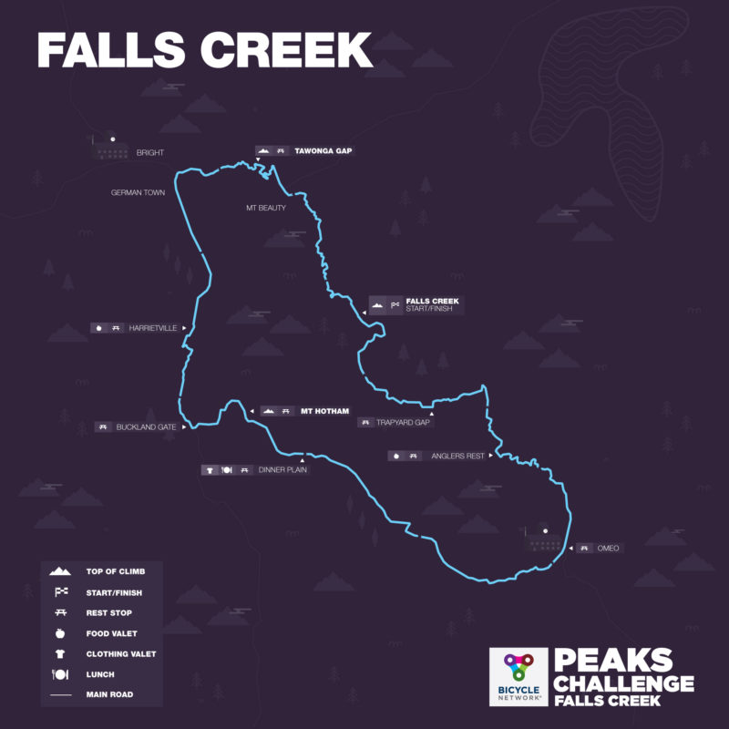

## Pre Event

My goal this year was to beat last years time 10:52:35, but I missed my goal and my finishing time was 11:14:58.

### Official Timing

#### 2022

|                | Time of Day | Chip     | Time Sector | Speed     | Distance |
| -------------- | ----------- | -------- | ----------- | --------- | -------- |
| Start          | 6:52:49     | .        | .           | .         | .        |
| TawongaBase    | 7:50:40     | 0:57:51  | 0:57:51     | 35.0 km/h | 33.7 km  |
| TawongaTop     | 8:23:43     | 1:30:54  | 0:33:03     | 13.4 km/h | 41.1 km  |
| HothamBase     | 9:21:21     | 2:28:32  | 0:57:38     | 34.4 km/h | 74.1 km  |
| HothamTop      | 11:34:32    | 4:41:44  | 2:13:12     | 12.9 km/h | 102.8 km |
| Dinner Plain   | 12:19:01    | 5:26:12  | 0:44:29     | 17.8 km/h | 116 km   |
| Omeo           | 13:48:10    | 6:55:21  | 1:29:09     | 28.9 km/h | 159 km   |
| FallsCreekBase | 15:25:27    | 8:23:39  | 1:37:18     | 24.7 km/h | 200 km   |
| FallsCreekTop  | 17:41:15    | 10:48:26 | 2:15:48     | 09.8 km/h | 225 km   |
| Finish.        | 18:07:46    | 11:14:58 | 0:26:02     | 30.7 km/h | 235 km   |

#### 2021

|                | Time of Day | Chip     | Time Sector | Speed     | Distance |
| -------------- | ----------- | -------- | ----------- | --------- | -------- |
| Start          | 7:02:04     | .        | .           | .         | .        |
| TawongaBase    | 7:53:35     | 0:51:31  | 0:51:31     | 39.1 km/h | 33.7 km  |
| TawongaTop     | 8:26:00     | 1:23:56  | 0:32:26     | 13.5 km/h | 41.1 km  |
| HothamBase     | 9:21:58     | 2:19:54  | 0:55:58     | 35.5 km/h | 74.1 km  |
| HothamTop      | 11:31:48    | 4:29:44  | 2:09:50     | 13.0 km/h | 102.8 km |
| Dinner Plain   | 12:14:40    | 5:12:36  | 0:42:53     | 18.2 km/h | 116 km   |
| Omeo           | 13:33:29    | 6:31:25  | 1:18:49     | 33.5 km/h | 159 km   |
| FallsCreekBase | 15:35:38    | 8:33:34  | 2:02:10     | 19.7 km/h | 200 km   |
| FallsCreekTop  | 17:32:09    | 10:30:05 | 1:56:31     | 12.4 km/h | 225 km   |
| Finish.        | 17:54:39    | 10:52:35 | 0:22:31     | 35.3 km/h | 235 km   |

#### 2020

|                | Time of Day | Chip     | Time Sector | Speed     |
| -------------- | ----------- | -------- | ----------- | --------- |
| Start          | 6:56:00     | .        | .           | .         |
| TawongaBase    | 7:50:35     | 0:54:34  | 0:54:34     | 36.9 km/h |
| TawongaTop     | 8:24:37     | 1:28:37  | 0:34:02     | 12.9 km/h |
| HothamBase     | 9:29:18     | 2:33:17  | 1:04:40     | 30.7 km/h |
| HothamTop      | 11:38:21    | 4:42:21  | 2:09:03     | 13.1 km/h |
| Omeo           | 14:10:46    | 7:14:45  | 2:32:24     | 21.8 km/h |
| FallsCreekBase | 16:12:25    | 9:16:24  | 2:01:38     | 19.8 km/h |
| FallsCreekTop  | 18:05:17    | 11:09:16 | 1:52:52     | 12.8 km/h |
| Finish.        | 18:35:54    | 11:39:53 | 0:30:37     | 26.1 km/h |

[Official event timing](https://www.bicyclenetwork.com.au/rides-and-events/peaks-challenge/event-timing/)

## Tips

- You don't need a long stop at Dinner Plain; recover while descending into Omeo.
- Prepare for cold and wet and changing weather conditions.
- At the stops just refill and go - otherwise you waste a lot of time.
- Stop on the side of the road instead of using toilet if possible.

## Nutrition

### Pre Event

For breakfast I had porridge.

### During Event

I my first drink had Red Bull, and then I just refilled with SIS drink mix and Hydralyte electrolyte tabs.

I drank a lot and but only had two toilet stops, half way up Mt Hotham and in Omeo.

The lunch stop at Dinner Plain provided chicken and wrap with sundried tomatoe, which tasted bland but did the job.

At Omeo I had brownies that was very sugary, but it boosted my energy and digested well.

I had a nutbar at Diggers Rest.

At Trapyard Gap I had Coke and a banana.

## Equipment

- Bike: Giant TCR 2015 rim brakes
- Gearing: Compact crack set with 11-28 cassette
- Wheels: Fulcrum 3
- Tyres: GP4000
- Groupset: Shimano 105
- Computer: Garmin 830
- Heart Rate: Polar H10
- Drink Bottles: 950ml SIS, 750ml SIS

Happy with equipment, but bottom bracket creaked when I was out of the saddle.

## Clothing

- Jersey: Giro short sleeve
- Bibs : Pearl Izumi
- Gillet: Pedla
- Base Layer: Maap
- Gloves: Short finger from Decathlon
- Arm Warmers: Running Arm Covers from Decathlon
- Socks : Decathlon
- Shoes : Giro with velcro laces
- Neck Warmer: Bike Exchange
- Jacket: NZO Tarmac
- Toe Covers : Castelli

#### Dropped after descent

- Long Sleeve jacket: NZO Tarmac
- Giro head bland
- Arm Warmers

## Training

My training wasn't ideal, lacking structure. I tried to follow the recommendations from my Garmin 830. What helped my endurance and finish was all the long low intensity rides that helped build my base.

### Event Training Rides

I did two training rides with Bicycle Network. Lake Mountain and the Kinglake Repeats. They were helped me to realise my 10 hour goal was too ambitious.

## Final Preparations - Last Week

### Condition

Didn't feel 100% the week before the ride. I didn't do enough kilometeres my endrance suffered.

## The Event

The weather was perfect, sunny but not too hot, just a little light rain before Anglers Rest.

## Falls Creek Descent

Good conditions for the start, not too cold and didn't need long finger gloves.

## Towonga Gap

Road strong up Towonga, and road with the 10 hour group near the top, but lost contact maybe 100m before the top of the climb.

## Harrietville

The ride to Harrietville was at a good pace, and I didn't stop.

## Mt Hotham

I rode up Mt Hotham at a steady pace. For the first section up to the rest stop I rode with an older man and younger lady.

## Dinner Plain

Didn't stay long at Dinnner Plain, I just ate my lunch and filled my water bottles. I didn't need to use the toilets which saved time.

## Omeo

The ride to Omeo was comfortable except for the last hill where the 11 hour leader increased the pace. I had a short stop at Omeo and ate a brownie and used the toilet and left before the 11 hour group.

## Anglers Rest

Rode a comfortable pass to Anglers Rest. The 11 hour group caught up just before the twisty section into Anglers Rest. They rode away on the descent because there were breaks in the group.

I had a short stop in Anglers Rest, just filled my water bottles and ate a Kind Nut Bar

## WTF Corner and back of Falls Creek

Struggled, I had to get off the bike after 100m, just before the photographer. It was hard getting back on the bike for my photo. It was a struggle all the way up the steep part, and I had to get off and walf a number of times.

## Trapyard Gap

I had a short stop at Trapyard Gap, just ate a banana and drank my Coke.

## To the Finish Line in Falls Creek

The weather at the after Trapyard Gap was cooler and there was thunder but no rain. I rode and easy pace to the finish and enjoyed the views.

## Finish Line

I felt emotional crossing the finish line with everyone cheering. It was a hard ride. At the finishline I received a finishers jersey and ticket with my official times, small serve of pasta and a recovery drink.

Moving Time: 10:25:58 (Garmin)

Total Distance 235km

Climb 1: Tawonga Gap
7.5km | 476m elevation | 6% average gradient

Climb 2: Mt Hotham
29.9km | 1,303m elevation | 4% average gradient

Climb 3: Falls Creek
22.6km | 980m elevation | 4% average gradient

## Post Event Recovery

Post event I felt better then expected, very tiered but not smashed.
Resting heart rate - night before the event : 54 bpm
Resting heart rate - day after the event : 53 bpm

### Condition

I had a little muscle soreness, mainly the thighs.

### Nutrition Post Event

Warm wrap and soft drink.
