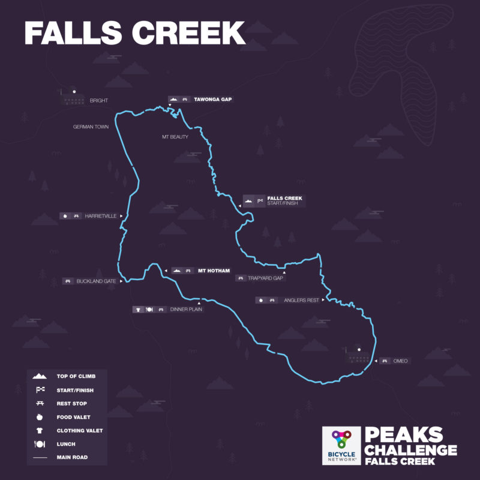

import DateCountdown from '../utility/dateCountdown.js'

This page is a **dashboard** to tracking cycling events.

#### Events

Next event: 130km [Alpine Classic](https://www.alpineclassic.com.au) on the **23rd January 2021 in Bright.

Countdown to event: <DateCountdown date={"01/23/2021"} />

### Past Events

Completed the [Three Peaks Challenge 2020](https://www.bicyclenetwork.com.au/rides-and-events/peaks-challenge/) in under **10 hours**.

On <u>8th March 2020</u> **<DateCountdown date={"03/08/2020"} />** days ago.

---

Cancelled: 2020 Alpine Classic was cancelled due to bush fires in the area. <DateCountdown date={"01/23/2020"} />